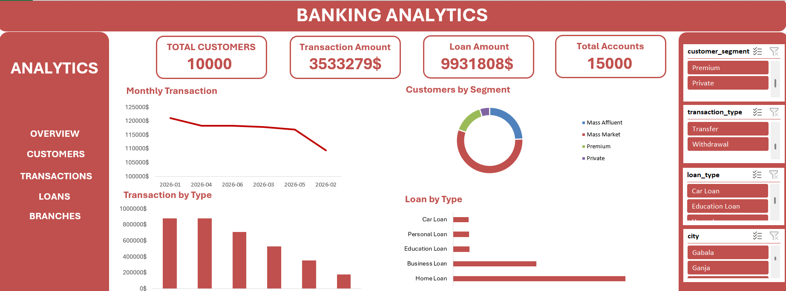
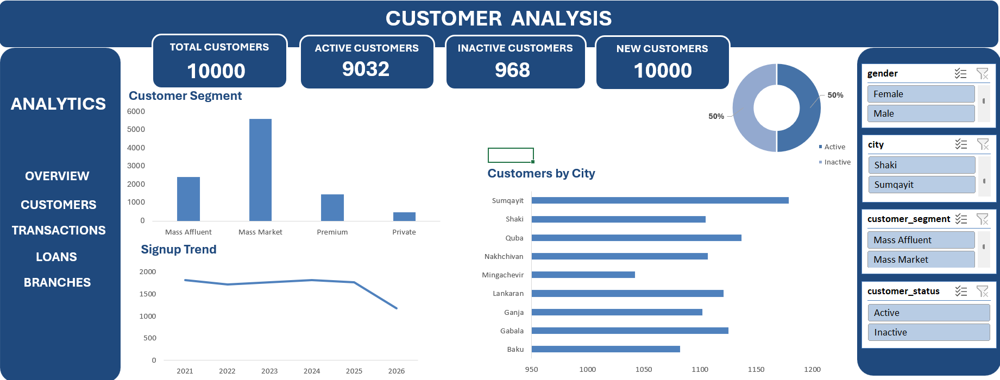
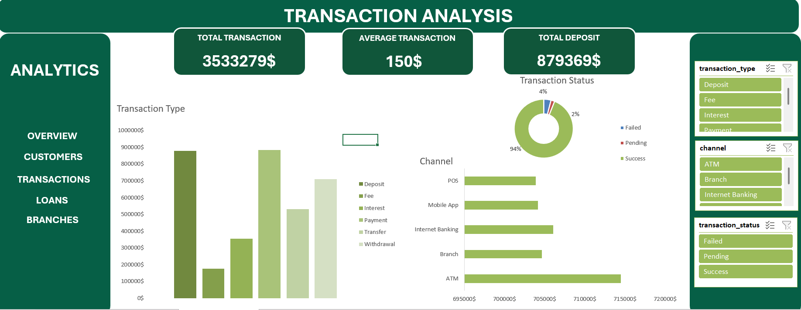
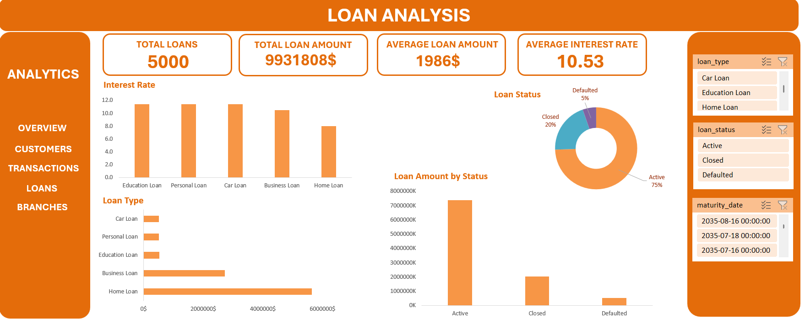
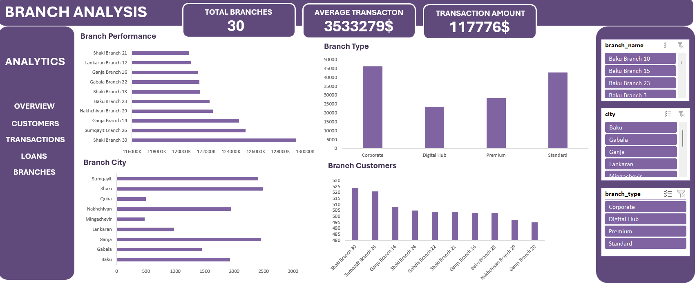

# 🏦 Banking Customer, Transaction & Risk Analytics

An end-to-end banking analytics project using **MySQL, Python, Pandas, and Excel** to analyze customers, accounts, transactions, loans, cards, complaints, branches, and campaigns.

## 📌 Project Overview

The project follows an end-to-end data analytics workflow:

**MySQL → Python & Pandas → Excel Dashboard → Business Insights**

The analysis focuses on customer activity, transaction behavior, branch performance, loan trends, and banking risk indicators.

## 🛠️ Technologies

* **MySQL** — Database design, data storage, relationships, and SQL
* **Python** — Data generation and analysis
* **Pandas** — Data manipulation and analysis
* **Excel** — Dashboard development and visualization

## 🗄️ Database Structure

The database contains 10 main tables:

* Customers
* Branches
* Employees
* Accounts
* Transactions
* Loans
* Loan Payments
* Cards
* Complaints
* Campaigns

The tables are connected through relational keys to represent a realistic banking environment.

## 🐍 Python & Pandas Analysis

Python was used to generate and insert the banking dataset into MySQL.

Pandas was used for:

* Data loading and exploration
* Grouping and aggregation
* Transaction status analysis
* Branch performance analysis
* Monthly transaction type analysis
* Loan status analysis

## 📊 Excel Dashboard

The final analysis was visualized through an interactive Excel dashboard containing KPIs, charts, PivotTables, and filters.

### Key KPIs

* Total Branches
* Total Customers
* Total Transactions
* Transaction Value
* Average Transaction

### Dashboard Areas

* Customer Analysis
* Transaction Analysis
* Loan Analysis
* Branch Analysis
* Overall Banking Performance

## 🖼️ Dashboard Preview

### Overview



### Customer



### Transaction



### Loan



### Branch



## 📁 Project Structure

```text
Banking-Customer-Transaction-Risk-Analytics/
│
├── images/
│   ├── overview.png
│   ├── customer.png
│   ├── transaction.png
│   ├── loan.png
│   └── branch.png
│
├── bank.py
├── bank.sql
├── banking_analyticss.xlsx
├── requirements.txt
├── .gitignore
└── README.md
```

## ▶️ How to Run

### 1. Create the database

Run `bank.sql` in MySQL to create the database, tables, and relationships.

### 2. Configure MySQL

Update your MySQL credentials in `bank.py`:

```python
connection = mysql.connector.connect(
    host="localhost",
    user="YOUR_USERNAME",
    password="YOUR_PASSWORD",
    database="banking_analytics_db"
)
```

### 3. Install dependencies

```bash
pip install -r requirements.txt
```

### 4. Run the project

```bash
python bank.py
```

## 📈 Key Skills

* MySQL
* SQL
* Python
* Pandas
* Data Analysis
* Excel
* PivotTables
* Dashboard Development
* Business Analytics
* Banking Analytics

## 👩‍💻 Author

**Aysel Hasanova**

Data Analyst interested in **SQL, Python, Excel, Power BI, and Business Analytics**.
